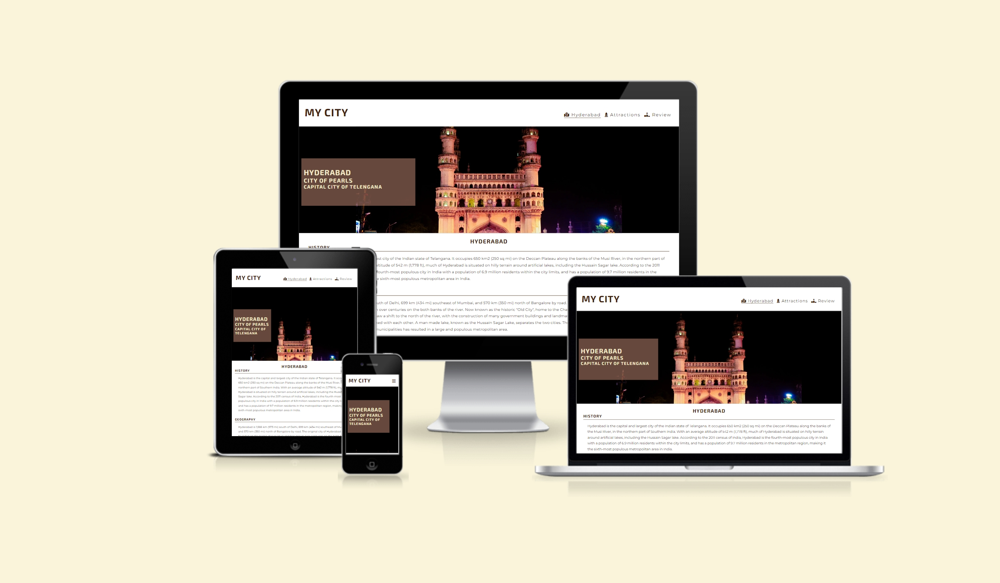
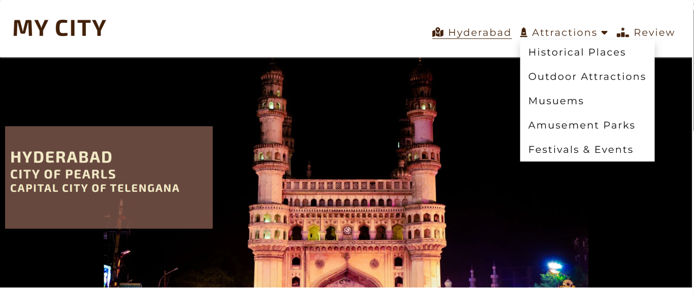
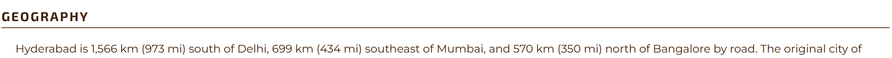
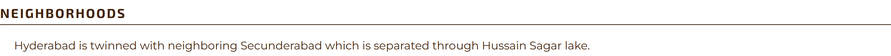
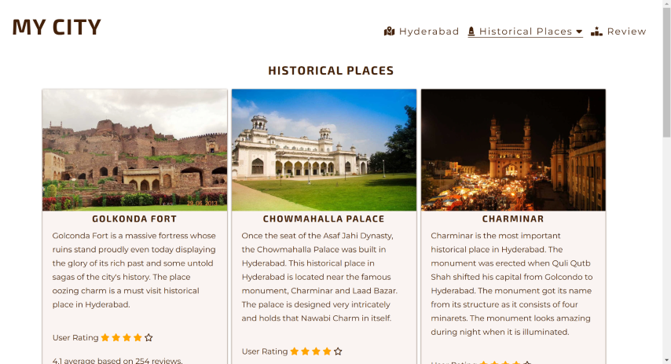
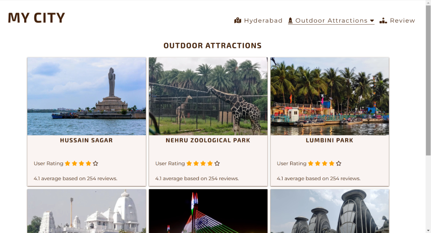
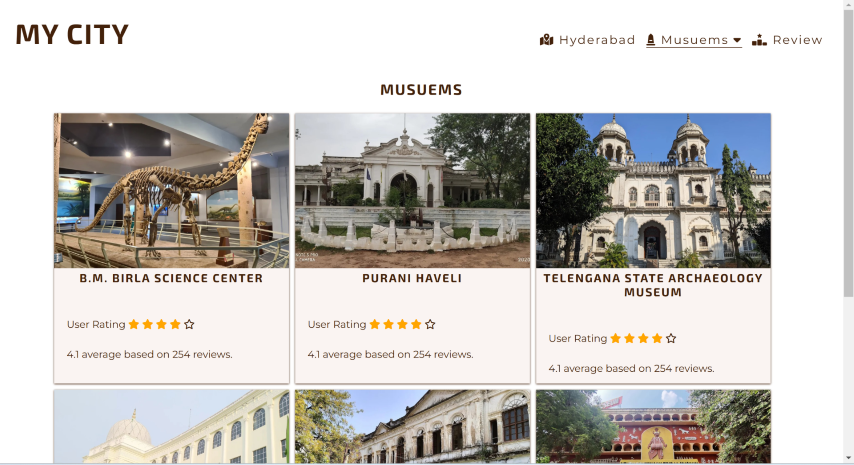
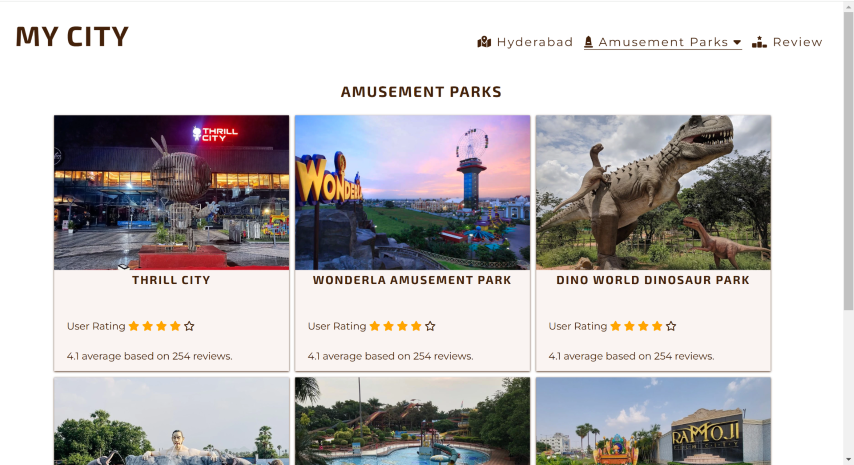
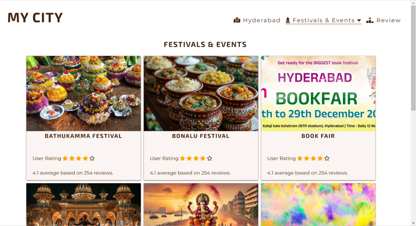

# MY CITY

My City is a site that hopes to help tourists, visitors or anyone enthusiastic to learn about a particular city. Initially for start, the site is configured only with one city as direct selection.

In future development more cities shall be added and we shall try to gather exclusive images dedicated to this site.

If you want to include your city / place in this site, please update your details in the review page, so that we can gather information required and update the site.

## Features 

The site main features are focused on providing information regarding the city, i.e., a breif wikipedia style information, also providing information which is useful for first time visitors, tourists, students.. Further features are explained in detail below in the Existing Features.

### Existing Features

- __Navigation Bar__

  - Featured on all three pages, the full responsive navigation bar including links to the Logo/Site Title, Hyderabad(My City), a dropdown selection of Attractions and a Review page. which are identical in each page to allow for easy navigation.
  - This section will allow the user to easily navigate from page to page across all devices without having to revert back to the previous page via the ‘back’ button. 
  

- __The landing page image__

  - The landing includes a photograph of the city with text overlay mentioning the city name & recognition provided for that city. 
  - This section introduces the user to indulge in further learning about the city and its attractions.

- __The Information Section about MyCity__

  - This section starts with a heading of the selected city and follows by a breif description of the History of the City, Geography of the City, Neighborhoods of the City, Climate of the City.

- __Dropdown menu Attractions__

  - Accessing this Dropdown menu gives further links to pages where more information is provided.
  - Each page is identical in view, where a image showing the place and a description of that place is provided, along with these information, the Rating provided by other users also provided.

- __The Footer__ 

  - The footer section includes links to the relevant social media sites for My City. 
  - The links will open to a new tab to allow easy navigation for the user. 
  - The footer is valuable to the user as it encourages them to keep connected via social media.

### Features Left to Implement

- The Home Page is configured to show a single City information and further attractions were also to the same city, in future, that can be changed to a drop down menu selecting different cities and the attraction drop down automatically displays the relevant selected city information.
- Each Attraction Page is now limited to displaying a single image, which can be implemented further using a Image Carousel with Controls, Indicators & Captions
- Description for each place can be added to all pages, now only Historical Places is displaying along with description.
- User Ratings provided are showing only as a example, which can be implemented to the real data.
- No Javascript or back end script was implemented as of now, upon further development and requirement more functionality can be added.

## Testing 

- Tested on Desktop, Tablet & Mobile Devices with out any problems.
- Desktop version tested on Microsoft Surface Pro 7 & 24inch Extension Monitor(1920 x 1080).
- Tablet version tested on Apple IPad Air4.
- Mobile version tested on Apple IPhone 12, IPhone 16 Pro Max, Samsung Galaxy A51, Samsung Galaxy S23 Ultra
- All the testing are done both in Potrait mode and Landscape mode also.

### Validator Testing 

- HTML

  - No errors were returned when passing through the official [W3C validator Home Page](https://validator.w3.org/nu/?doc=https%3A%2F%2Faremandanaveenkumar.github.io%2Fmycity-hyderabad%2Findex.html)
  - No errors were returned when passing through the official [W3C validator Historical Places Page](https://validator.w3.org/nu/?doc=https%3A%2F%2Faremandanaveenkumar.github.io%2Fmycity-hyderabad%2Fhistoricalplaces.html)
  - No errors were returned when passing through the official [W3C validator Outdoor Attractions Page](https://validator.w3.org/nu/?doc=https%3A%2F%2Faremandanaveenkumar.github.io%2Fmycity-hyderabad%2Foutdoorattractions.html)
  - No errors were returned when passing through the official [W3C validator Musuems Page](https://validator.w3.org/nu/?doc=https%3A%2F%2Faremandanaveenkumar.github.io%2Fmycity-hyderabad%2Fmusuems.html)
  - No errors were returned when passing through the official [W3C validator Amusement Parks Page](https://validator.w3.org/nu/?doc=https%3A%2F%2Faremandanaveenkumar.github.io%2Fmycity-hyderabad%2Famusementparks.html)
  - No errors were returned when passing through the official [W3C validator Festivals & Events Page](https://validator.w3.org/nu/?doc=https%3A%2F%2Faremandanaveenkumar.github.io%2Fmycity-hyderabad%2Ffestivalsandevents.html)

- CSS

  - No errors were found when passing through the official [(Jigsaw) validator  Home Page & style.css](https://jigsaw.w3.org/css-validator/validator?uri=https%3A%2F%2Faremandanaveenkumar.github.io%2Fmycity-hyderabad%2Findex.html&profile=css3svg&usermedium=all&warning=1&vextwarning=&lang=en)
  - No errors were found when passing through the official [(Jigsaw) validator  All Attractions Pages, style.css & attractions.css](https://jigsaw.w3.org/css-validator/validator?uri=https%3A%2F%2Faremandanaveenkumar.github.io%2Fmycity-hyderabad%2Fhistoricalplaces.html&profile=css3svg&usermedium=all&warning=1&vextwarning=&lang=en)

## Deployment

- The site was deployed to GitHub pages. The steps to deploy are as follows: 
  - In the GitHub repository, navigate to the Settings tab 
  - From the source section drop-down menu, select the Master Branch
  - Once the master branch has been selected, the page will be automatically refreshed with a detailed ribbon display to indicate the successful deployment. 

The live link can be found here - https://aremandanaveenkumar.github.io/mycity-hyderabad/index.html

## Credits 

This project is developed based on the reference project taught by [Code Institute](https://codeinstitute.net/global/)

### Content 

- The text for the Home page was taken from [Wikipedia Article](https://en.wikipedia.org/wiki/Hyderabad)
- The icons in the footer were taken from [Font Awesome](https://fontawesome.com/)
 
- The tour guide icon used for favicon is taken from [freepik](https://www.freepik.com/icon/tour-guide_9675725) 
- The Fonts [Exo 2](https://fonts.google.com/specimen/Exo+2) & [Montserrat](https://fonts.google.com/specimen/Montserrat) were taken from [google fonts](https://fonts.google.com)
- The website [Incredible India](https://www.incredibleindia.gov.in/en/telangana) was referred for reference as a tourist information site, from which most of the ideas were developed.
- The photo used on the home for landing page is taken from (https://wallpaperswide.com/charminar-wallpapers.html)
- The images used in the attractions pages were taken from (https://www.holidify.com/collections/historical-places-in-hyderabad) , (https://en.wikipedia.org/wiki/Hyderabad) and google

